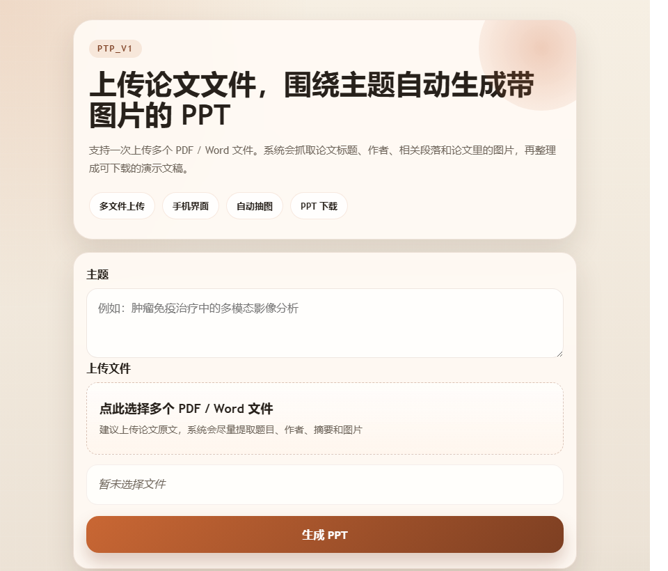
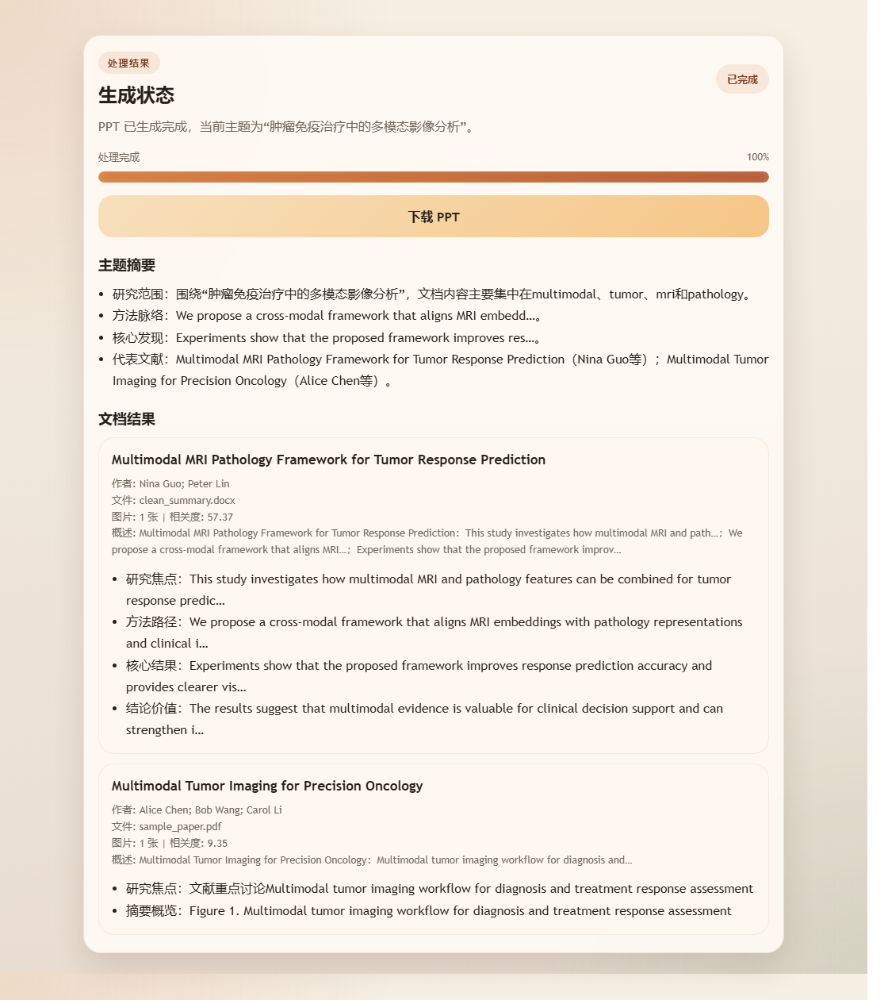

# PTP_v1

一个本地运行的论文转 PPT 小项目，支持手机端友好的上传界面。

> 本地运行，无需外部大模型 API。上传 PDF / Word 论文后，系统会围绕指定主题整理文本与插图，并生成可下载的 PPT 初稿。

## 界面展示

<p align="center">
  
  
</p>

<p align="center">
  上传页面 / 结果页面
</p>

## 使用流程

1. 输入本次汇报或研究整理的主题
2. 一次上传多个 `.pdf`、`.docx`、`.doc`
3. 系统自动解析标题、作者、摘要、正文相关段落和论文图片
4. 生成并下载带结构化内容的 `.pptx` 文件

## 主要功能

- 一次上传多个 `.pdf`、`.docx`、`.doc`
- 用户输入主题后，自动筛选和主题相关的关键内容
- 尽量抽取论文标题、作者、摘要和正文相关段落
- 从 PDF / Word 中提取论文图片并带入 PPT
- 对扫描版 PDF 提供 OCR 文本提取回退
- 单个文件或单张图片异常时尽量降级处理，不阻断整份 PPT 下载
- 生成可下载的 `.pptx` 文件

## 运行方式

```powershell
cd F:\PTP_v1
python -m venv .venv
.venv\Scripts\activate
pip install -r requirements.txt
python webapp.py
```

浏览器打开：

```text
http://127.0.0.1:5050
```

手机访问时，确保手机和电脑在同一局域网，可使用：

```text
http://电脑局域网IP:5050
```

也可以直接双击运行：

```text
F:\PTP_v1\start.bat
```

双击后会弹出一个服务窗口，并在几秒后自动打开浏览器。

## 文件说明

- `webapp.py`：Flask 入口与上传/下载接口
- `app.py`：兼容启动脚本
- `app/services/document_parser.py`：PDF/Word 解析、标题作者识别、图片提取
- `app/services/topic_extractor.py`：主题相关片段打分与摘要整理
- `app/services/ppt_generator.py`：PPT 页面生成
- `templates/index.html`：移动端页面
- `static/css/style.css`：页面样式
- `static/js/app.js`：前端上传和结果展示逻辑

## 关于 Word `.doc`

`.docx` 开箱即用。  
如果要直接支持老格式 `.doc`，建议本机安装 Microsoft Word，并额外安装：

```powershell
pip install pywin32
```

项目会尝试通过 Word 自动转成 `.docx` 再解析。

## 当前实现说明

- 主题抽取目前采用本地关键词相关度算法，不依赖外部大模型 API
- 图片会优先提取尺寸较大的论文插图，避免把小图标和装饰图带进 PPT
- 标题和作者会优先使用文档元数据，缺失时回退到正文首页启发式识别
- 对文本提取质量较差的 PDF 页面，会自动尝试 OCR 提升摘要可用性
- 如果某篇文档图片损坏或图片页生成失败，系统会返回 warning，但会尽量继续生成可下载 PPT
